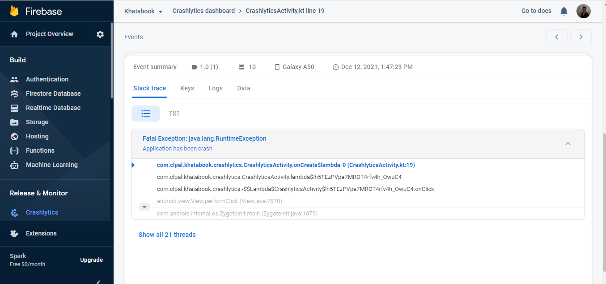
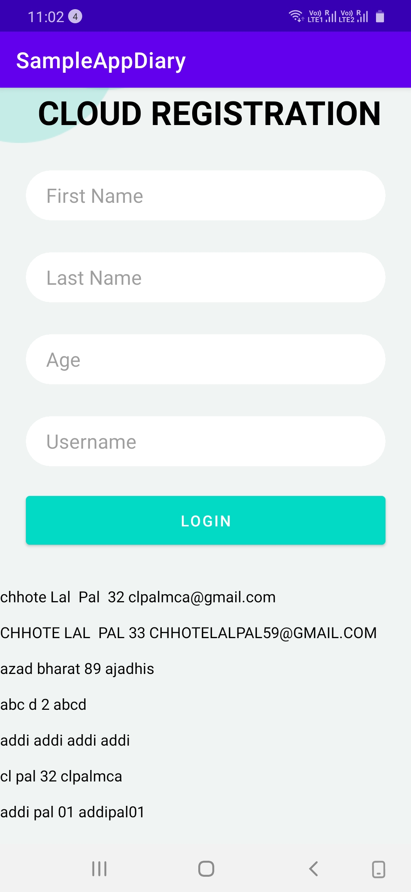

# Please check in this repository all branch to see all samples .

# Crashlytics
button 

##### <b> Attaching some screenshots: </b> 

 

# Crashlytics
button 

##### <b> Attaching some screenshots: </b> 

 

# Crashlytics
button 

##### <b> Attaching some screenshots: </b> 

 

# Crashlytics
button 

##### <b> Attaching some screenshots: </b> 

 

# Crashlytics
button 

##### <b> Attaching some screenshots: </b> 

 

# Crashlytics
button 

##### <b> Attaching some screenshots: </b> 

 

# Crashlytics
button 

##### <b> Attaching some screenshots: </b> 

 

# Crashlytics
button 

##### <b> Attaching some screenshots: </b> 

 

# Crashlytics
button 

##### <b> Attaching some screenshots: </b> 

 

# Crashlytics
button 

##### <b> Attaching some screenshots: </b> 

 

# Crashlytics
button 

##### <b> Attaching some screenshots: </b> 

 

# Crashlytics
button 

##### <b> Attaching some screenshots: </b> 

 

# Crashlytics
button 

##### <b> Attaching some screenshots: </b> 

 

<li><a href="/RecyclerView">RecyclerView</a> </li>

